# Cloudflare Worker Setup (Stream-Tools)

This guide explains how to create and configure the Cloudflare Worker used by `monitor.py`.

At the end, you will have:
- a public worker base URL (example: `https://stream-tools-worker.<subdomain>.workers.dev`)
- one KV binding named `STREAM_TOOLS_KV`
- one secret named `UPDATE_TOKEN`

Then you can run `create_env.bat`.

---

## 1) Create a Worker

1. Login to Cloudflare dashboard.
2. Go to **Workers & Pages**.
3. Click **Create application**.
4. Click **Start with Hello World!**
5. Enter your worker name and deploy.

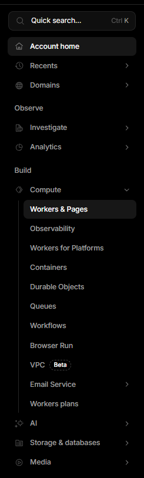
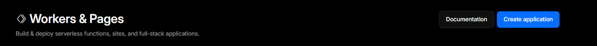

---

## 2) Create KV namespace

1. In **Workers & Pages**, open **KV**.
2. Click **Create instance**.
3. Give it any name (example: `stream-tools-kv`).

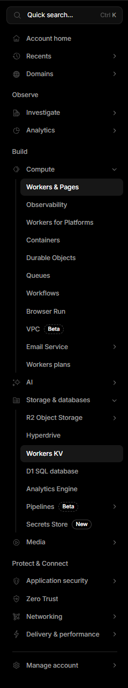
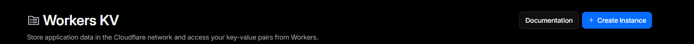
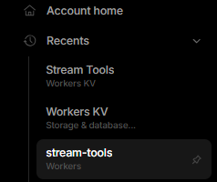

---

## 3) Bind KV to your Worker

1. Go back to your worker.
2. Open **Settings**.
3. Open **Bindings** (or click **Add binding**).
4. Add a **KV Namespace** binding.
5. Set variable name exactly to:
   - `STREAM_TOOLS_KV`
6. Select the KV namespace you created.
7. Save / Add binding.

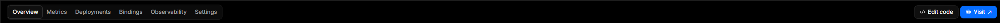
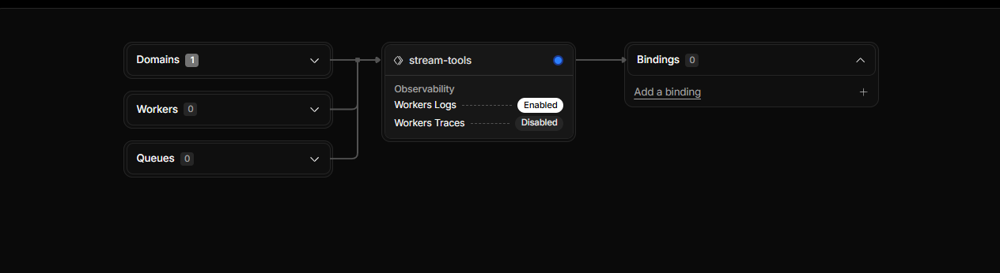
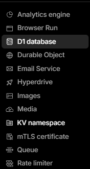
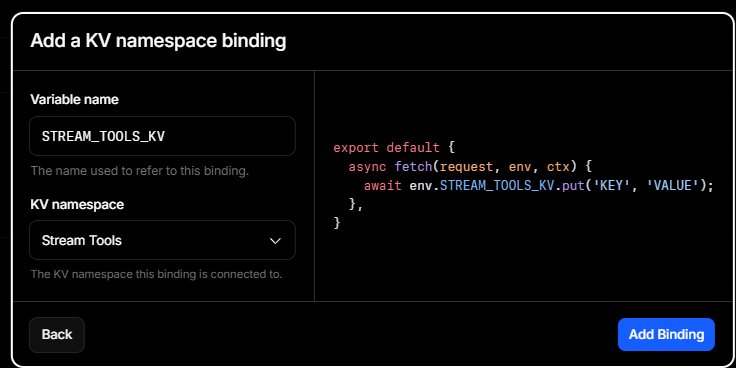

---

## 4) Add Worker secret

1. In worker **Settings**, open **Variables**.
2. Add secret:
   - Name: `UPDATE_TOKEN`
   - Value: any strong random string
3. Save.

Keep this value: you will put the same token in `create_env.bat` when asked for `CF_UPDATE_TOKEN`.

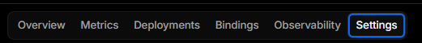
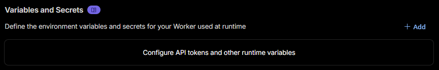
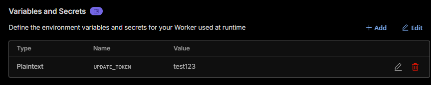

---

## 5) Paste worker code and deploy

1. Click **Edit code**.
2. Replace code with the content of:
   - `cloudflare-worker.js`
3. Click **Deploy**.

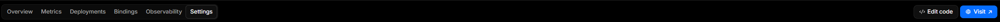
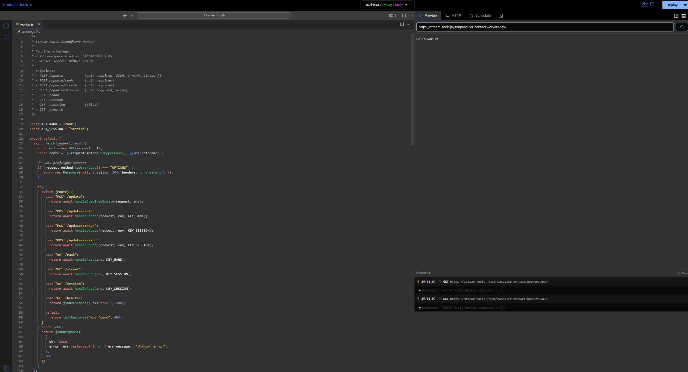

---

## 6) Copy base URL and run create_env.bat

You need:
- `CF_WORKER_BASE_URL` = your worker URL without extra path  
  Example: `https://stream-tools-worker.<subdomain>.workers.dev`
- `CF_UPDATE_TOKEN` = the exact `UPDATE_TOKEN` secret value

Then run:
- `create_env.bat`

---

## 7) Quick endpoint test (recommended)

Before running the monitor, test from terminal:

```bash
curl "<BASE_URL>/health"
curl "<BASE_URL>/rank"
curl "<BASE_URL>/streak"
```

You should get valid responses (even empty rank/streak is fine before first update).

---

## Checklist (did you miss anything?)

- Worker exists and is deployed
- KV namespace exists
- KV binding name is exactly `STREAM_TOOLS_KV`
- Secret name is exactly `UPDATE_TOKEN`
- Worker code from `cloudflare-worker.js` is deployed
- You copied base URL correctly into `.env` (`CF_WORKER_BASE_URL`)
- You copied same token into `.env` (`CF_UPDATE_TOKEN`)
