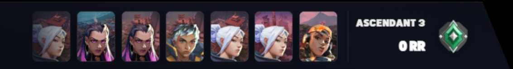
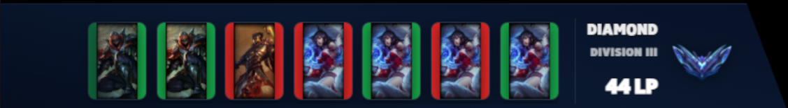

# Stream-Tools

Local tool for Twitch streamers. While you are live, it reads your Twitch category, picks **Valorant** or **League of Legends**, and keeps these up to date:

- Chat commands **`!rank`** and **`!streak`** (via a Cloudflare Worker)
- Optional **rank overlay** in OBS or Streamlabs (browser source)

---

## Quick start (recommended order)

| Step | What to do |
|------|------------|
| **1** | Run [`install.bat`](install.bat) — installs Python packages |
| **2** | Set up Cloudflare — follow [`Cloudflare.md`](Cloudflare.md) (screenshots included) |
| **3** | Run [`create_env.bat`](create_env.bat) — creates your `.env` (asks for every value) |
| **4** | Start the monitor — OBS script, terminal, or [`start-streamlabs.bat`](start-streamlabs.bat) |
| **5** | Add the overlay in OBS/Streamlabs — use the **HTTP URL** from the monitor log (not `file://`) |
| **6** | (OBS only) Point OBS Scripts to Python — see [Python for OBS](#python-for-obs-scripts) below |

---

## What you need before `create_env.bat`

`create_env.bat` walks you through everything. Here is what each part is and where to get it.

### API keys (always asked)

| `.env` variable | Used for | Where to get it |
|-----------------|----------|-----------------|
| `HENRIK_API_KEY` | Valorant rank / MMR | [Henrik API dashboard](https://api.henrikdev.xyz/dashboard/) |
| `RIOT_API_KEY` | LoL rank / matches | [Riot Developer Portal](https://developer.riotgames.com) — personal/dev key is enough to start ([key types](https://developer.riotgames.com/app-type)) |

### Valorant (optional — say **Y** when asked)

| `.env` variable | What it is | How to get it |
|-----------------|------------|---------------|
| `VAL_PUUID` | Your account ID for Valorant APIs | `create_env.bat` can fetch it from Riot name + tag, or paste manually |
| `VAL_REGION` | API region (e.g. `eu`) | Default in the script is usually fine |
| `VAL_PLATFORM` | Platform (e.g. `pc`) | Default `pc` |

**Tip:** The batch file prints a Henrik lookup URL; open it in a browser to see your PUUID if auto-fetch fails.

### League of Legends (optional — say **Y** when asked)

| `.env` variable | What it is | How to get it |
|-----------------|------------|---------------|
| `LOL_PUUID` | Your account ID for LoL APIs | Auto-fetch from Riot ID or paste manually |
| `LOL_REGION` | Regional route (e.g. `europe`) | Match your server |
| `LOL_PLATFORM` | League platform (e.g. `euw1`) | Match your server |

### Twitch (required)

| `.env` variable | What it is | Where to get it |
|-----------------|------------|---------------|
| `TWITCH_CHANNEL` | Your channel login (lowercase) | Your Twitch username |
| `TWITCH_CLIENT_ID` | Twitch app client ID | [Twitch Token Generator](https://twitchtokengenerator.com) or [Twitch OAuth docs](https://dev.twitch.tv/docs/authentication/getting-tokens-oauth) |
| `TWITCH_ACCESS_TOKEN` | OAuth user token | Same as above — generate a token with access to your channel |

### Cloudflare (required for `!rank` / `!streak`)

| `.env` variable | What it is | Where to get it |
|-----------------|------------|---------------|
| `CF_WORKER_BASE_URL` | Worker URL, no path at the end | **Preview** tab URL bar on your worker — see [Cloudflare.md §6](Cloudflare.md#6-copy-base-url-and-run-create_envbat) and `cloudflare-image/image-15.png` |
| `CF_UPDATE_TOKEN` | Secret you chose when creating the worker | Same value as Cloudflare secret `UPDATE_TOKEN` — see [Cloudflare.md](Cloudflare.md) |

### Runtime (defaults are fine for most users)

| `.env` variable | Meaning | Default |
|-----------------|---------|---------|
| `POLL_INTERVAL_SECONDS` | How often the monitor checks Twitch/APIs | `20` |
| `TEST_MODE` | Test without being live on Twitch | `false` |

---

## Installation details

### 1) `install.bat`

Double-click **`install.bat`** in the project folder. It needs **Python 3.10+** on your PATH.

### 2) Cloudflare Worker

Follow **[Cloudflare.md](Cloudflare.md)** step by step (KV binding, `UPDATE_TOKEN`, deploy `cloudflare-worker.js`, copy base URL from Preview).

### 3) `create_env.bat`

Double-click **`create_env.bat`**. It creates **`.env`** in the same folder. You can re-run it anytime to regenerate (it overwrites `.env`).

At least **one** game (Valorant or LoL) must be enabled.

---

## Running the monitor

### Option A — OBS (recommended if you use OBS)

1. Install Python for OBS — [Python for OBS scripts](#python-for-obs-scripts)
2. Open OBS → **Tools** → **Scripts** → **+** → select **`monitor.py`**
3. OBS starts the script when it launches (no extra `.bat` needed)
4. Check the script log for: `[HTTP] OBS Browser Source URL: http://127.0.0.1:8787/rank/overlay.html` (or `overlay-v2.html`)

### Option B — Terminal

```bat
python monitor.py
```

Keep the window open while streaming.

### Option C — Streamlabs Desktop

OBS can load `monitor.py` as a script on startup; **Streamlabs does not**, so use **`start-streamlabs.bat`**:

1. Open **`start-streamlabs.bat`** in a text editor
2. Set **`STREAMLABS_EXE`** to the full path of your Streamlabs Desktop `.exe`  
   Example: `C:\Program Files\Streamlabs OBS\Streamlabs OBS.exe`
3. Double-click **`start-streamlabs.bat`** — it opens Streamlabs **and** starts `monitor.py` in a second window

`monitor.py` is always loaded from the same folder as the `.bat` (repo root).

---

## Python for OBS scripts

1. Download and run the installer:  
   [Python 3.13.10 (64-bit)](https://www.python.org/ftp/python/3.13.10/python-3.13.10-amd64.exe)
2. On the first installer screen, check **“Add python.exe to PATH”** (bottom-left / center of the window), then finish install.
3. In OBS: **Tools** → **Scripts** → **Python settings** (gear) → set **Python Install Path** to the folder where Python was installed, for example:  
   `C:\Users\YourName\AppData\Local\Programs\Python\Python313\`  
   (the folder that contains `python.exe`, not the `.exe` itself — OBS may accept either depending on version; use the install directory if unsure).

Then add **`monitor.py`** via the **+** button in Scripts.

---

## Overlay (browser source)

- **Do not** use `file:///.../rank/overlay.html` — use the **HTTP** URL printed when the monitor starts.
- Default: `http://127.0.0.1:8787/rank/overlay.html` or `http://127.0.0.1:8787/rank/overlay-v2.html`
- In OBS/Streamlabs: add a **Browser** source, paste that URL, set width/height as needed.

The overlay can auto-switch Valorant/LoL from your Twitch category if you add Helix params to the URL (`auto_game=1`, `twitch_client_id`, `twitch_access_token`) — see comments at the top of `rank/overlay-v2.html`.

---

## Output examples

**`!rank`**

- Valorant: `Ascendant 3 : 0 RR [-18]`
- LoL: `DIAMOND III : 16 LP [+42]`

**`!streak`**

- Valorant: `3W / 1L +28 RR | Last game : Split -20 RR`
- LoL: `7W / 2L +5 LP | Last game : Riven -58 LP`

**Overlays**




---

## Files cheat sheet

| File | Purpose |
|------|---------|
| `install.bat` | Install Python dependencies |
| `create_env.bat` | Interactive `.env` creator |
| `start-streamlabs.bat` | Open Streamlabs + run `monitor.py` |
| `monitor.py` | Main script (OBS script or terminal) |
| `Cloudflare.md` | Worker + KV setup with screenshots |
| `cloudflare-worker.js` | Worker code to paste in Cloudflare |
| `rank/overlay.html` | Overlay v1 |
| `rank/overlay-v2.html` | Overlay v2 (new layout) |
| `.env.example` | Example env file (reference only) |

---

## Troubleshooting

- **`!rank` / `!streak` not updating** — check `CF_WORKER_BASE_URL` and `CF_UPDATE_TOKEN`, then test with `curl <BASE_URL>/health` (see [Cloudflare.md](Cloudflare.md)).
- **Overlay blank** — use `http://127.0.0.1:8787/...` from the log, not a local file path; ensure `monitor.py` is running.
- **Wrong game** — Twitch category must contain “Valorant” or “League of Legends”; or use chat `!valo` / `!lol` on the overlay.
- **Python not found in OBS** — complete [Python for OBS scripts](#python-for-obs-scripts) above.
